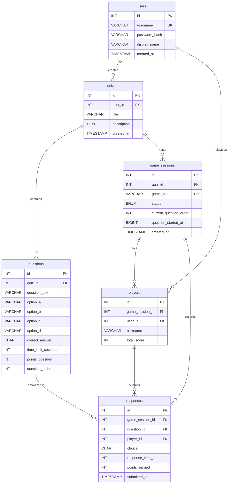
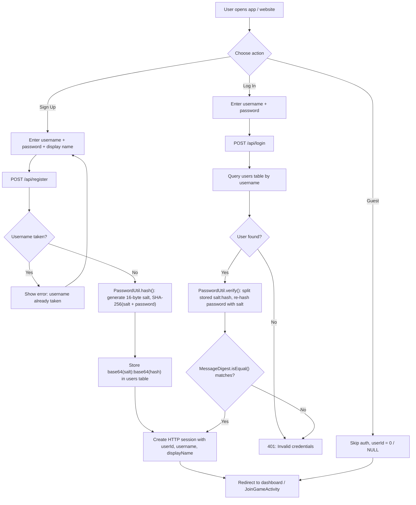
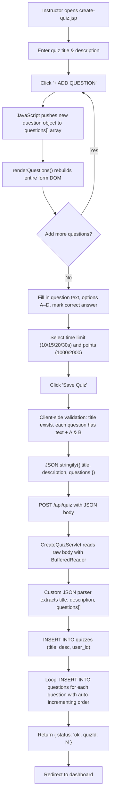
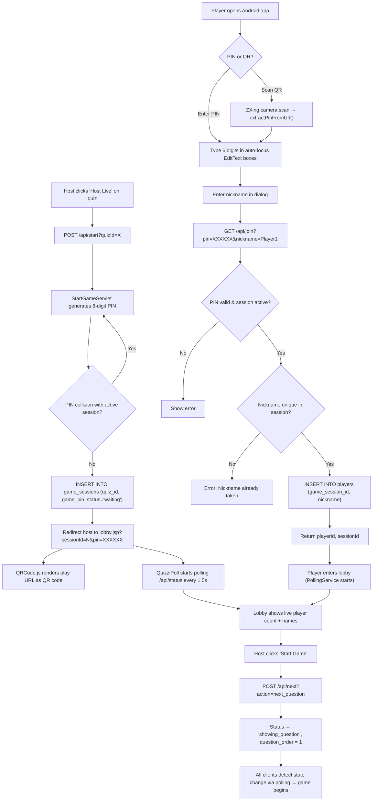
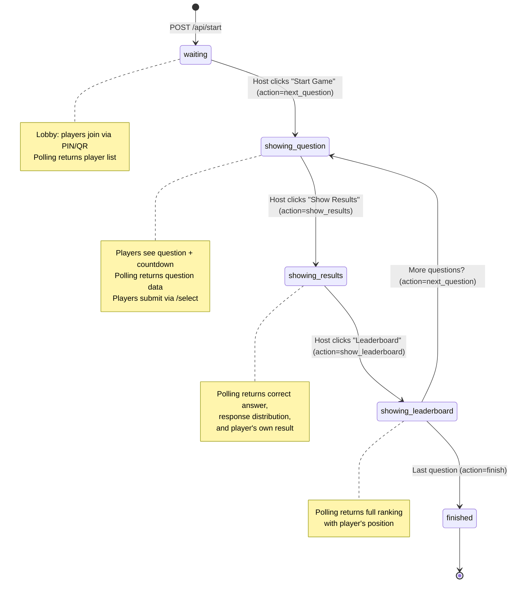
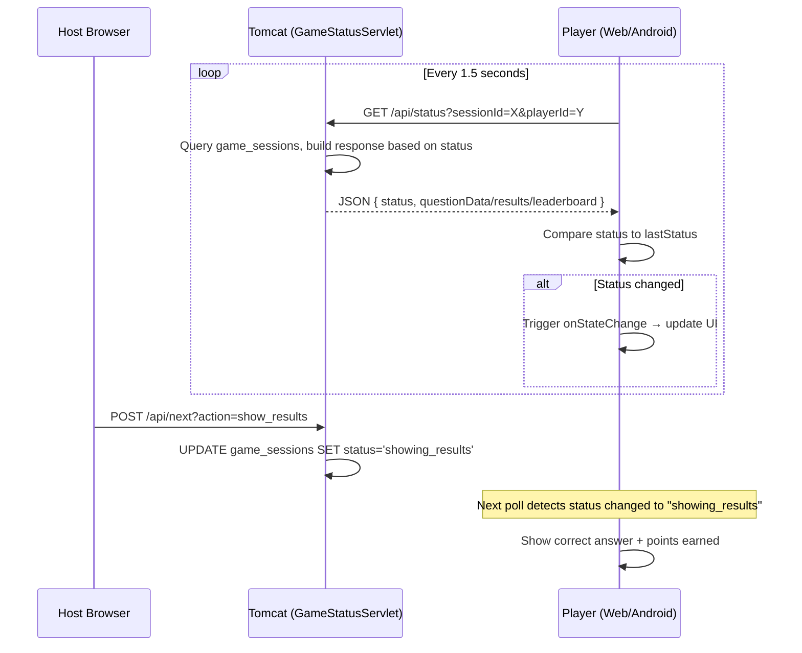
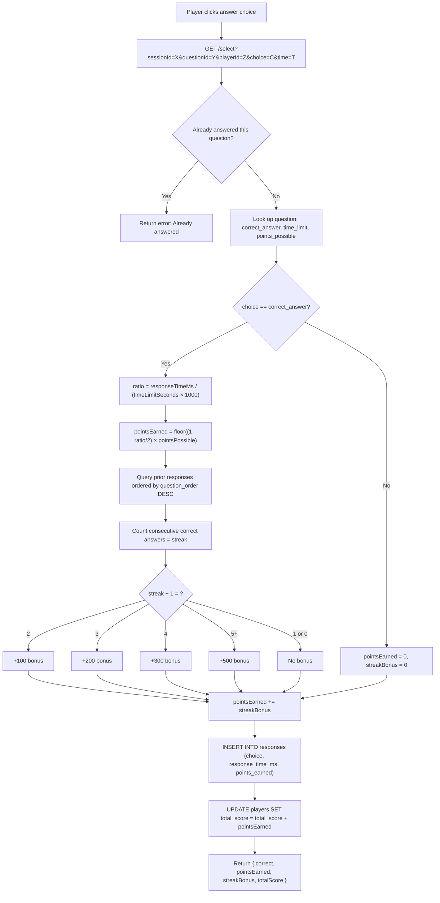

# Quizzi — Classroom Live Quiz System

A Kahoot-style live quiz platform built for the IM2073 course at NTU. Hosts create quizzes and run live game sessions; players join with a **6-digit PIN** (or QR code) on a browser or the Android app and compete in real time.

**What you get in this repo**

| Surface | Who it is for | What it does |
|--------|----------------|--------------|
| **Web — welcome & dashboard** | Host / instructor | Optional **sign up / log in**, or **continue as guest**. Manage quizzes, host games, show lobby QR and leaderboards. |
| **Web — `/play/`** | Student / player | Mobile-friendly flow: enter PIN → nickname → live game. |
| **Android app** | Student / player | **Auth screen** (login, sign up, or guest), then PIN/QR join and the same game loop as the web player. |

All game logic and data live on the **Tomcat + MySQL** backend; clients talk to it over HTTP (polling for state).

---

## Table of Contents

- [Quick Start — Web App (macOS)](#quick-start--web-app-macos)
- [Quick Start — Android App](#quick-start--android-app)
- [What each part of the system does](#what-each-part-of-the-system-does)
- [Architecture Overview](#architecture-overview)
- [Entity-Relationship Diagram](#entity-relationship-diagram)
- [Project Structure](#project-structure)
- [Prerequisites](#prerequisites)
- [Setup Guide — macOS](#setup-guide--macos)
- [Setup Guide — Windows](#setup-guide--windows)
- [Database Setup (Both Platforms)](#database-setup-both-platforms)
- [Upgrading an existing database](#upgrading-an-existing-database)
- [Configuring DB Credentials](#configuring-db-credentials)
- [Building, deploying, and redeploying](#building-deploying-and-redeploying)
- [Android App Setup](#android-app-setup)
- [Accounts, sessions, and guests](#accounts-sessions-and-guests)
- [How to Use](#how-to-use)
- [Scoring System](#scoring-system)
- [Feature Deep Dives](#feature-deep-dives)
  - [Feature 1: User Authentication & Registration System](#feature-1-user-authentication--registration-system)
  - [Feature 2: Custom Quiz Creation with Configurable Questions](#feature-2-custom-quiz-creation-with-configurable-questions)
  - [Feature 3: Real-time Game Lobby with PIN Code & QR Code Join](#feature-3-real-time-game-lobby-with-pin-code--qr-code-join)
  - [Feature 4: Live Game Engine with State Machine & Polling](#feature-4-live-game-engine-with-state-machine--polling)
  - [Feature 5: Speed-Based Scoring with Streak Bonuses](#feature-5-speed-based-scoring-with-streak-bonuses)
  - [Feature 6: Custom JSON Parser (No External Libraries)](#feature-6-custom-json-parser-no-external-libraries)
- [API Reference](#api-reference)
- [Database Schema](#database-schema)
- [Troubleshooting](#troubleshooting)

---

## Quick Start — Web App (macOS)

> Assumes you have Homebrew installed. For detailed instructions or Windows setup, see the full guides below.

```bash
# 1. Install prerequisites
brew install openjdk@17 mysql tomcat

# 2. Start MySQL
brew services start mysql

# 3. Set your MySQL root password (if you haven't already)
mysql_secure_installation

# 4. Create the database
mysql -u root -p < database/schema.sql

# 5. Set your DB password in the source code
#    Edit quizzi-web/WEB-INF/classes/com/quizzi/DBUtil.java
#    and set: private static final String PASSWORD = "YOUR_PASSWORD";

# 6. Download the MySQL connector JAR
mkdir -p quizzi-web/WEB-INF/lib
curl -L -o quizzi-web/WEB-INF/lib/mysql-connector-j-9.1.0.jar \
  "https://repo1.maven.org/maven2/com/mysql/mysql-connector-j/9.1.0/mysql-connector-j-9.1.0.jar"

# 7. Find your Tomcat path (Homebrew may install tomcat or tomcat@10)
#    Apple Silicon: /opt/homebrew/opt/tomcat/libexec (or tomcat@10)
#    Intel:         /usr/local/opt/tomcat/libexec
export CATALINA_HOME=/opt/homebrew/opt/tomcat/libexec

# 8. Compile the servlets
chmod +x compile.sh
./compile.sh $CATALINA_HOME

# 9. Deploy (symlink for development)
# If webapps/quizzi already exists: rm -rf $CATALINA_HOME/webapps/quizzi
ln -s $(pwd)/quizzi-web $CATALINA_HOME/webapps/quizzi

# 10. Start Tomcat
$CATALINA_HOME/bin/catalina.sh run
```

Open [http://localhost:8080/quizzi/](http://localhost:8080/quizzi/) — the default welcome file is **`welcome.jsp`** (log in, sign up, or continue as guest). From there you can open the dashboard, create quizzes, or jump to the player join flow.

> **Tomcat version:** This codebase targets **Tomcat 10+** with **Jakarta EE** (`jakarta.servlet` in Java, Jakarta `web.xml` schema). Homebrew's `tomcat` formula is typically Tomcat 10. If you still run Tomcat 9 with `javax.servlet`, the servlets will not load until you migrate or switch to Tomcat 10 — see [Troubleshooting](#troubleshooting).

## Quick Start — Android App

1. **Open the project** — Launch Android Studio and open the `quizzi-android/` folder
2. **Wait for Gradle sync** — Android Studio will download all dependencies automatically (this may take a few minutes on first open)
3. **Create an emulator** (if you don't have one):
   - Go to **Tools > Device Manager**
   - Click **Create Device**
   - Select a phone (e.g. Pixel 6), click **Next**
   - Choose a system image with **API 26+** (download it if needed), click **Next > Finish**
4. **Check the server URL** — The file `app/src/main/java/com/quizzi/utils/Constants.java` is pre-configured for the Android emulator:
   ```java
   public static final String BASE_URL = "http://10.0.2.2:8080/quizzi";
   ```
   - This `10.0.2.2` address routes to your host machine's `localhost` from inside the emulator — no changes needed if your Tomcat server is running locally.
   - If using a **physical device**, change this to your machine's IP address (e.g. `http://192.168.1.100:8080/quizzi`). Both devices must be on the same WiFi network.
   - For a **deployed server**, set `BASE_URL` in `Constants.java` to that server's origin **including** the `/quizzi` context path, then rebuild the APK or App Bundle.
5. **Run the app** — The launcher screen is **`AuthActivity`** (log in, sign up, or guest). Pick a device, then use **Run** in Android Studio.
6. **Make sure Tomcat is running** — The app uses the same HTTP API as the website; start the backend before testing.

> **No Android Studio?** Use the web player at `http://HOST:8080/quizzi/play/index.jsp` in any mobile browser.

---

## What each part of the system does

| Path / app | Role |
|------------|------|
| **`welcome.jsp`** (site entry) | Sign up, log in, or continue as guest; links to dashboard and join flow. |
| **`index.jsp`** | Dashboard — list quizzes and host games (`GET /api/quizzes?mine=true` when logged in). |
| **`create-quiz.jsp`** | Build a quiz and `POST` it to `/api/quiz`. |
| **`lobby.jsp` / `host-game.jsp`** | Host views: PIN, QR code (URL points at `play/index.jsp`), live controls. |
| **`play/*.jsp`** | Player-only: PIN, nickname, in-game UI (no host account required). |
| **Android** | `AuthActivity` then `JoinGameActivity` and the rest of the game activities. |

---

## Architecture Overview

```
┌───────────────────────────────────────────────────────────┐
│               Apache Tomcat 10+ (Jakarta EE)              │
│  ┌─────────────────────────────────────────────────────┐  │
│  │  quizzi-web (exploded folder/ WAR, context /quizzi) │  │
│  │                                                     │  │
│  │  JSP / static            Servlets (HTTP API)        │  │
│  │  ├── welcome.jsp         ├── Login / Register /     │  │
│  │  ├── index.jsp …         │   Logout / AuthStatus    │  │
│  │  ├── create-quiz.jsp …   ├── CreateQuiz, ListQuiz   │  │
│  │  ├── lobby.jsp …         ├── StartGame, JoinGame    │  │
│  │  ├── play/*.jsp          ├── GameStatus, Next …     │  │
│  │  ├── css/, images/       ├── Select, Display …      │  │
│  │                          └── Results, Leaderboard   │  │
│  └─────────────────────────────────────────────────────┘  │
│                            │ JDBC                         │
│                            ▼                              │
│                    ┌──────────────┐                       │
│                    │   MySQL 8+   │                       │
│                    │   (quizzi)   │                       │
│                    └──────────────┘                       │
└───────────────────────────────────────────────────────────┘
        ▲ HTTP                              ▲ HTTP
        │                                   │
  ┌─────┴──────┐                     ┌───────┴───────┐
  │  Browser   │                     │  Android app  │
  │  host+play │                     │  auth + game  │
  └────────────┘                     └───────────────┘
```

All clients use HTTP against Tomcat. Live game UIs poll about every **1.5 seconds** (for example via `/api/status`).

---

## Entity-Relationship Diagram



**Key relationships:**
- A **user** can create many **quizzes** (`quizzes.user_id` → `users.id`, nullable for guests).
- Each **quiz** has many **questions** ordered by `question_order`.
- A **game session** is one live play-through of a quiz, identified by a unique 6-digit `game_pin`.
- **Players** join a game session with a nickname. The `user_id` is nullable (guests have no account).
- Each **response** records a player's answer to a specific question within a game session, including their choice, response time in milliseconds, and points earned.

---

## Project Structure

```
quizzi/
│
├── README.md                          This file
├── compile.sh                         Compile all servlets (needs CATALINA_HOME)
├── logo.png                           Optional design asset (not required to run)
│
├── database/
│   └── schema.sql                     MySQL schema (users + quizzes + game data)
│
├── quizzi-web/                        Tomcat web application (context /quizzi)
│   ├── WEB-INF/
│   │   ├── web.xml                    Jakarta EE 6 deployment descriptor + welcome file
│   │   ├── classes/com/quizzi/        Java sources (compiled in place to .class)
│   │   │   ├── DBUtil.java            JDBC connection settings
│   │   │   ├── PasswordUtil.java      Password hashing
│   │   │   ├── LoginServlet.java      POST /api/login
│   │   │   ├── RegisterServlet.java   POST /api/register
│   │   │   ├── LogoutServlet.java     POST /api/logout
│   │   │   ├── AuthStatusServlet.java GET  /api/auth/status
│   │   │   ├── CreateQuizServlet.java POST /api/quiz
│   │   │   ├── ListQuizServlet.java   GET  /api/quizzes
│   │   │   ├── StartGameServlet.java  POST /api/start
│   │   │   ├── JoinGameServlet.java   GET  /api/join
│   │   │   ├── GameStatusServlet.java GET  /api/status
│   │   │   ├── NextQuestionServlet.java POST /api/next
│   │   │   ├── SelectServlet.java     GET  /select
│   │   │   ├── DisplayServlet.java    GET  /display
│   │   │   ├── ResultsServlet.java    GET  /api/results
│   │   │   └── LeaderboardServlet.java GET /api/leaderboard
│   │   └── lib/                       mysql-connector-j-*.jar
│   ├── css/, js/, images/             Static assets (favicon, logo, CSS, polling JS)
│   ├── welcome.jsp                    Landing: login / signup / guest
│   ├── index.jsp                      Dashboard
│   ├── create-quiz.jsp                Quiz editor
│   ├── lobby.jsp, host-game.jsp       Host live views
│   ├── leaderboard.jsp, podium.jsp    Results views
│   └── play/                          Web player (PIN, nickname, game)
│
└── quizzi-android/                    Android Studio project
    └── app/src/main/
        ├── AndroidManifest.xml        LAUNCHER = AuthActivity
        └── java/com/quizzi/
            ├── activities/            AuthActivity, JoinGameActivity, …
            ├── network/ApiClient.java
            └── utils/Constants.java     BASE_URL → backend

```

---

## Prerequisites

You need the following installed on your machine:

| Software | Version | Purpose |
|----------|---------|---------|
| Java JDK | **17** (recommended) | Compile servlets (`javac`) and build the Android app |
| Apache Tomcat | **10+** (Jakarta EE) | Servlet container — **Tomcat 9 / `javax.*` will not work** with this codebase |
| MySQL | 8 or higher | Store quizzes, sessions, and responses |
| Android Studio | Latest | Build and run the Android app (optional) |

---

## Setup Guide — macOS

### Step 1: Install Java JDK

```bash
# Using Homebrew (recommended)
brew install openjdk@17

# Add to your shell profile (~/.zshrc)
export JAVA_HOME=$(/usr/libexec/java_home)
export PATH="$JAVA_HOME/bin:$PATH"

# Reload your shell
source ~/.zshrc

# Verify
java -version
javac -version
```

### Step 2: Install MySQL

```bash
# Install via Homebrew
brew install mysql

# Start MySQL service
brew services start mysql

# Secure the installation (set root password)
mysql_secure_installation

# Verify it's running
mysql -u root -p -e "SELECT VERSION();"
```

### Step 3: Install Apache Tomcat

```bash
# Install via Homebrew
brew install tomcat

# Homebrew installs Tomcat to:
#   /opt/homebrew/opt/tomcat/libexec   (Apple Silicon)
#   /usr/local/opt/tomcat/libexec      (Intel)

# Set CATALINA_HOME in your ~/.zshrc
export CATALINA_HOME=/opt/homebrew/opt/tomcat/libexec   # Apple Silicon
# OR
export CATALINA_HOME=/usr/local/opt/tomcat/libexec      # Intel

source ~/.zshrc

# Verify
ls $CATALINA_HOME/lib/servlet-api.jar
```

### Step 4: Download MySQL Connector JAR

1. Go to [MySQL Connector/J Downloads](https://dev.mysql.com/downloads/connector/j/)
2. Select **Platform Independent**
3. Download the `.tar.gz` or `.zip` archive
4. Extract it and copy the JAR file:

```bash
cp mysql-connector-j-9.1.0.jar quizzi-web/WEB-INF/lib/
```

> If the `lib/` directory doesn't exist, create it first: `mkdir -p quizzi-web/WEB-INF/lib/`

### Step 5: Set Up the Database

```bash
mysql -u root -p < database/schema.sql
```

### Step 6: Configure DB Credentials

Edit `quizzi-web/WEB-INF/classes/com/quizzi/DBUtil.java` and set your MySQL password:

```java
private static final String PASSWORD = "";  // <-- set your MySQL root password here
```

### Step 7: Compile the Servlets

```bash
chmod +x compile.sh
./compile.sh
```

The script auto-detects `CATALINA_HOME` from common Homebrew locations. If it can't find Tomcat, pass the path explicitly:

```bash
./compile.sh /opt/homebrew/opt/tomcat/libexec
```

### Step 8: Deploy to Tomcat

**Option A — Copy (production-like):**
```bash
cp -r quizzi-web $CATALINA_HOME/webapps/quizzi
```

**Option B — Symlink (recommended for development):**
```bash
ln -s $(pwd)/quizzi-web $CATALINA_HOME/webapps/quizzi
```

### Step 9: Start Tomcat

```bash
$CATALINA_HOME/bin/catalina.sh run
```

> Use `catalina.sh run` to see logs in the terminal. Use `catalina.sh start` to run in the background.

### Step 10: Verify

Open [http://localhost:8080/quizzi/](http://localhost:8080/quizzi/) — you should get **`welcome.jsp`**. Sign in or use **Continue as guest**, then open the dashboard.

---

## Setup Guide — Windows

### Step 1: Install Java JDK

1. Download JDK 17 from [Oracle](https://www.oracle.com/java/technologies/downloads/) or [Adoptium](https://adoptium.net/)
2. Run the installer
3. Set environment variables:
   - Open **Start > Environment Variables** (search "Edit the system environment variables")
   - Under **System variables**, click **New**:
     - Variable name: `JAVA_HOME`
     - Variable value: `C:\Program Files\Java\jdk-17` (adjust to your install path)
   - Edit the `Path` variable and add: `%JAVA_HOME%\bin`
4. Open a **new** Command Prompt and verify:

```cmd
java -version
javac -version
```

### Step 2: Install MySQL

1. Download [MySQL Installer for Windows](https://dev.mysql.com/downloads/installer/)
2. Run the installer and choose **Server only** (or Full if you want MySQL Workbench)
3. During setup:
   - Set the root password (remember this)
   - Configure MySQL to run as a Windows Service (so it starts automatically)
4. Verify it's running:

```cmd
mysql -u root -p -e "SELECT VERSION();"
```

> If `mysql` is not found, add `C:\Program Files\MySQL\MySQL Server 8.0\bin` to your `Path` environment variable.

### Step 3: Install Apache Tomcat

1. Download **Tomcat 10** from [Apache Tomcat Downloads](https://tomcat.apache.org/download-10.cgi) (Jakarta EE / `jakarta.servlet`)
2. Download the **64-bit Windows zip** (not the installer)
3. Extract to a location like `C:\apache-tomcat-10`
4. Set environment variable:
   - Variable name: `CATALINA_HOME`
   - Variable value: `C:\apache-tomcat-10` (adjust to your extract path)
5. Add `%CATALINA_HOME%\bin` to your `Path`
6. Verify:

```cmd
dir %CATALINA_HOME%\lib\servlet-api.jar
```

### Step 4: Download MySQL Connector JAR

1. Go to [MySQL Connector/J Downloads](https://dev.mysql.com/downloads/connector/j/)
2. Select **Platform Independent**
3. Download and extract the archive
4. Copy the JAR:

```cmd
mkdir quizzi-web\WEB-INF\lib
copy mysql-connector-j-9.1.0.jar quizzi-web\WEB-INF\lib\
```

### Step 5: Set Up the Database

```cmd
mysql -u root -p < database\schema.sql
```

### Step 6: Configure DB Credentials

Edit `quizzi-web\WEB-INF\classes\com\quizzi\DBUtil.java` in any text editor and set your MySQL password:

```java
private static final String PASSWORD = "";  // <-- set your MySQL root password here
```

### Step 7: Compile the Servlets

Windows cannot run `compile.sh` directly. Use this command instead:

```cmd
javac -cp "%CATALINA_HOME%\lib\servlet-api.jar;quizzi-web\WEB-INF\lib\mysql-connector-j-9.1.0.jar" -d quizzi-web\WEB-INF\classes quizzi-web\WEB-INF\classes\com\quizzi\*.java
```

> **Key difference:** Windows uses `;` (semicolon) as the classpath separator, while macOS/Linux uses `:` (colon).

### Step 8: Deploy to Tomcat

```cmd
xcopy /E /I quizzi-web %CATALINA_HOME%\webapps\quizzi
```

> For development, you can also create a junction link:
> ```cmd
> mklink /J %CATALINA_HOME%\webapps\quizzi %cd%\quizzi-web
> ```

### Step 9: Start Tomcat

```cmd
%CATALINA_HOME%\bin\catalina.bat run
```

> Use `catalina.bat run` to see logs in the terminal. Use `startup.bat` to run in the background.

### Step 10: Verify

Open [http://localhost:8080/quizzi/](http://localhost:8080/quizzi/) — **`welcome.jsp`**. Then continue as guest or log in.

---

## Database Setup (Both Platforms)

The schema creates a database named `quizzi` with **six** tables:

| Table | Purpose |
|-------|---------|
| `users` | Optional accounts (username, password hash, display name) |
| `quizzes` | Quizzes (`user_id` nullable — guests can create quizzes) |
| `questions` | Questions with 2–4 options, correct answer, timer, points |
| `game_sessions` | Live sessions: 6-digit PIN, status, current question |
| `players` | Joined players (`user_id` nullable for guests) |
| `responses` | Each answer: choice, timing, points |

To reset the database (**destructive** — deletes all quizzes and accounts):

```bash
mysql -u root -p -e "DROP DATABASE quizzi;"
mysql -u root -p < database/schema.sql
```

---

## Upgrading an existing database

If you already had an older Quizzi database **without** accounts, run a one-time migration instead of dropping data:

```sql
USE quizzi;

CREATE TABLE IF NOT EXISTS users (
    id INT AUTO_INCREMENT PRIMARY KEY,
    username VARCHAR(50) NOT NULL UNIQUE,
    password_hash VARCHAR(255) NOT NULL,
    display_name VARCHAR(100),
    created_at TIMESTAMP DEFAULT CURRENT_TIMESTAMP
);

ALTER TABLE quizzes
    ADD COLUMN user_id INT NULL,
    ADD CONSTRAINT fk_quizzes_user FOREIGN KEY (user_id) REFERENCES users(id) ON DELETE SET NULL;

ALTER TABLE players
    ADD COLUMN user_id INT NULL,
    ADD CONSTRAINT fk_players_user FOREIGN KEY (user_id) REFERENCES users(id) ON DELETE SET NULL;
```

If MySQL reports a duplicate column, that part is already applied — skip it. Then **recompile servlets** and **restart Tomcat**.

---

## Configuring DB Credentials

All database configuration lives in a single file:

**`quizzi-web/WEB-INF/classes/com/quizzi/DBUtil.java`**

```java
private static final String URL = "jdbc:mysql://localhost:3306/quizzi?useSSL=false&allowPublicKeyRetrieval=true&serverTimezone=UTC";
private static final String USER = "root";
private static final String PASSWORD = "";  // Set your MySQL password
```

After changing this file, recompile the servlets and restart Tomcat — see [Building, deploying, and redeploying](#building-deploying-and-redeploying).

---

## Building, deploying, and redeploying

The webapp is always deployed at context path **`/quizzi`** (the folder name under `webapps`).

### What to do for each kind of change

| You changed | Action |
|-------------|--------|
| Any `*.java` under `WEB-INF/classes/com/quizzi/` | Recompile, then **restart Tomcat** (or reload the app) so new `.class` files load. |
| `web.xml` | Restart Tomcat. |
| `*.jsp`, `css/`, `js/`, `images/` | Save files; **refresh the browser**. With a **copy** deploy, sync `quizzi-web` into `webapps/quizzi` again. |
| SQL schema or live DB | Run migrations or `schema.sql` against MySQL (see [Database Setup](#database-setup-both-platforms)). |
| `WEB-INF/lib/*.jar` | Add/replace JAR; recompile if needed; restart Tomcat. |
| Android code or `BASE_URL` | **Rebuild** in Android Studio. |

### Symlink vs copy

- **Symlink / junction** (good for local dev): `webapps/quizzi` → your repo's `quizzi-web`. After `javac`, restart Tomcat for servlet changes; static files are read from disk immediately.
- **Copy / rsync / CI** (servers): After compile, deploy the full `quizzi-web` tree (or a built WAR) into `webapps/quizzi`, then restart Tomcat.

### Compile servlets

**macOS / Linux:**

```bash
./compile.sh
# or: ./compile.sh /opt/homebrew/opt/tomcat/libexec
```

**Windows:**

```cmd
javac -cp "%CATALINA_HOME%\lib\servlet-api.jar;quizzi-web\WEB-INF\lib\mysql-connector-j-9.1.0.jar" -d quizzi-web\WEB-INF\classes quizzi-web\WEB-INF\classes\com\quizzi\*.java
```

### Redeploy after a copy-based install

**macOS / Linux:**

```bash
rm -rf $CATALINA_HOME/webapps/quizzi
cp -r quizzi-web $CATALINA_HOME/webapps/quizzi
# or: rsync -a --delete quizzi-web/ $CATALINA_HOME/webapps/quizzi/
```

**Windows:**

```cmd
rmdir /S /Q %CATALINA_HOME%\webapps\quizzi
xcopy /E /I /Y quizzi-web %CATALINA_HOME%\webapps\quizzi
```

### Restart and clear JSP cache

Stop Tomcat, optionally delete `work/Catalina/localhost/quizzi/` under `$CATALINA_HOME`, then start again.

### Production (short checklist)

- Prefer **HTTPS** in front of Tomcat; Android cleartext is mainly for dev/LAN.
- Use a dedicated MySQL user in `DBUtil`, not `root`, on real deployments.
- Point Android `BASE_URL` at your public origin + `/quizzi`.

---

## Android App Setup

1. Open `quizzi-android/` in **Android Studio**
2. Wait for Gradle sync to complete (it downloads dependencies automatically)
3. Configure the server URL in `app/src/main/java/com/quizzi/utils/Constants.java`:

```java
public static final String BASE_URL = "http://10.0.2.2:8080/quizzi";  // Emulator → host machine
```

| Scenario | BASE_URL |
|----------|----------|
| Android Emulator | `http://10.0.2.2:8080/quizzi` (default — routes to host machine's localhost) |
| Physical device on same WiFi | `http://YOUR_MACHINE_IP:8080/quizzi` (find your IP with `ipconfig` or `ifconfig`) |
| Deployed server | `https://your.domain/quizzi` (must match Tomcat context path) |

4. Build and run on an emulator or device (minimum SDK 26 / Android 8.0)

### Android Dependencies

These are managed by Gradle and downloaded automatically:

| Library | Version | Purpose |
|---------|---------|---------|
| AndroidX AppCompat | 1.6.1 | Backwards-compatible UI components |
| Material Components | 1.11.0 | Material Design widgets |
| ConstraintLayout | 2.1.4 | Flexible layout system |
| ZXing Android Embedded | 4.3.0 | QR code scanning |

---

## Accounts, sessions, and guests

- **Web:** **`welcome.jsp`** is the landing page. **Sign up** stores a hashed password in `users`. **Log in** creates an HTTP session with `userId`, `username`, and `displayName`. **Continue as guest** skips accounts; you can still host, but new quizzes get `user_id = NULL` until you log in.
- **API:** `GET /api/auth/status` returns whether the browser session is authenticated. `POST /api/logout` invalidates it.
- **Android:** **`AuthActivity`** uses `/api/login` and `/api/register`, then passes **`userId`** (or `0` for guest) into **`JoinGameActivity`**.
- **Players** using a PIN do not need an account; the **`play/`** flow is separate from the host dashboard.

---

## How to Use

### First-time visit (web)

1. Open [http://localhost:8080/quizzi/](http://localhost:8080/quizzi/) — you should see **Welcome**.
2. Sign up, log in, or **Continue as guest**, then open **My Quizzes** (`index.jsp`).

### Create a Quiz (Instructor)

1. From the dashboard, click **"+ CREATE QUIZ"**
3. Enter a title and description
4. Add questions with 2-4 answer options
5. Mark the correct answer for each question
6. Set time limit (10/15/20/30 seconds) and points (Standard 1000 / Double 2000)
7. Click **"Save Quiz"**

### Host a Live Game (Instructor)

1. On the dashboard, click **"Host Live"** on any quiz
2. The lobby screen displays a **6-digit Game PIN** and **QR code**
3. Project the lobby screen and share the PIN with students
4. Watch players join in real-time
5. Click **"Start Game"** when ready

### Join as a Student

**Via Web Browser:**
1. Go to `http://HOST_IP:8080/quizzi/play/index.jsp` (or `/quizzi/play/` if your server maps it)
2. Enter the 6-digit Game PIN
3. Enter a nickname
4. Play the game in the browser

**Via Android App:**
1. Open the app; log in, sign up, or use **guest**
2. Enter the 6-digit Game PIN or scan the QR code
3. Enter a nickname
4. Wait in the lobby, then answer questions as they appear

### Game Flow

```
Lobby → Question (countdown timer) → Answer → Waiting for Results
  → Score Reveal (correct/wrong + points earned)
  → Leaderboard (top players)
  → Next Question ... → Final Podium (top 3 players)
```

The host controls the pace by advancing through each stage manually.

---

## Scoring System

Points are calculated using a Kahoot-style formula based on response speed:

```
points = floor((1 - (response_time_ms / time_limit_ms) / 2) * points_possible)
```

- Wrong answers always score **0 points**
- Fastest correct answer earns **~100%** of the possible points
- Slowest correct answer earns **~50%** of the possible points

### Streak Bonuses

| Consecutive Correct | Bonus Points |
|---------------------|-------------|
| 2 in a row  | +100 |
| 3 in a row  | +200 |
| 4 in a row  | +300 |
| 5+ in a row | +500 |

---

## Feature Deep Dives

### Feature 1: User Authentication & Registration System

**Description:** Full user sign-up and login with SHA-256 salted password hashing (never stored in plaintext). Server-side HTTP session management for authenticated users. Android login/signup/guest entry UI with tab-based form switching and input validation. Supports guest mode for quick play without registration. `PasswordUtil` handles secure hashing and constant-time verification.

**Files:** `AuthActivity.java` (lines 1–155), `LoginServlet.java` (lines 1–85), `RegisterServlet.java` (lines 1–99), `PasswordUtil.java` (lines 1–37), `AuthStatusServlet.java` (lines 1–41), `LogoutServlet.java` (lines 1–30), `activity_auth.xml` (lines 1–271)

**References:** SHA-256 `MessageDigest` (Java standard library), Jakarta EE 9 `HttpSession` API ([https://jakarta.ee/specifications/servlet/](https://jakarta.ee/specifications/servlet/))

#### How It Works

The authentication system uses a **salted SHA-256 hash** to protect passwords. When a user registers, `PasswordUtil.hash()` generates a cryptographically random 16-byte salt using `SecureRandom`, prepends it to the password before hashing with SHA-256, and stores the result as `base64(salt):base64(hash)` in the database. On login, `PasswordUtil.verify()` splits the stored value, re-derives the hash with the original salt, and compares using `MessageDigest.isEqual()` which is a constant-time comparison to prevent timing attacks.

**Password Hashing — `PasswordUtil.java`:**

```java
public static String hash(String password) {
    try {
        byte[] salt = new byte[16];
        RANDOM.nextBytes(salt);                              // 16 random bytes
        MessageDigest md = MessageDigest.getInstance("SHA-256");
        md.update(salt);                                     // prepend salt
        byte[] digest = md.digest(password.getBytes("UTF-8"));
        return Base64.getEncoder().encodeToString(salt)      // "salt:hash"
             + ":" + Base64.getEncoder().encodeToString(digest);
    } catch (Exception e) {
        throw new RuntimeException("Hash failed", e);
    }
}

public static boolean verify(String password, String stored) {
    try {
        String[] parts = stored.split(":");
        byte[] salt = Base64.getDecoder().decode(parts[0]);
        byte[] expectedHash = Base64.getDecoder().decode(parts[1]);
        MessageDigest md = MessageDigest.getInstance("SHA-256");
        md.update(salt);
        byte[] actualHash = md.digest(password.getBytes("UTF-8"));
        return MessageDigest.isEqual(expectedHash, actualHash); // constant-time
    } catch (Exception e) {
        return false;
    }
}
```

**Registration Flow — `RegisterServlet.java`:** The servlet reads the JSON body, validates constraints (username 3–50 chars, password at least 4 chars), checks uniqueness with a `SELECT`, hashes the password, inserts the user row, then creates an HTTP session.

```java
// Check username uniqueness
PreparedStatement check = conn.prepareStatement("SELECT id FROM users WHERE username = ?");
check.setString(1, username);
if (check.executeQuery().next()) {
    resp.setStatus(409);
    out.print("{\"status\":\"error\",\"message\":\"Username already taken\"}");
    return;
}

// Hash and insert
String hash = PasswordUtil.hash(password);
PreparedStatement stmt = conn.prepareStatement(
    "INSERT INTO users (username, password_hash, display_name) VALUES (?, ?, ?)",
    Statement.RETURN_GENERATED_KEYS);
stmt.setString(1, username);
stmt.setString(2, hash);
stmt.setString(3, displayName);
stmt.executeUpdate();
```

**Login Flow — `LoginServlet.java`:** Looks up the user by username, verifies the password against the stored hash, and creates an HTTP session with `userId`, `username`, and `displayName` attributes.

```java
String storedHash = rs.getString("password_hash");
if (!PasswordUtil.verify(password, storedHash)) {
    resp.setStatus(401);
    out.print("{\"status\":\"error\",\"message\":\"Invalid username or password\"}");
    return;
}
HttpSession session = req.getSession(true);
session.setAttribute("userId", userId);
session.setAttribute("username", username);
session.setAttribute("displayName", displayName);
```

**Android Auth UI — `AuthActivity.java`:** Uses a view-switching pattern with three `LinearLayout` panels (welcome, login, signup). The `showView()` method toggles visibility to simulate tab navigation without fragments.

```java
private void showView(LinearLayout target) {
    welcomeView.setVisibility(target == welcomeView ? View.VISIBLE : View.GONE);
    loginView.setVisibility(target == loginView ? View.VISIBLE : View.GONE);
    signupView.setVisibility(target == signupView ? View.VISIBLE : View.GONE);
}
```

#### Logic Flow



---

### Feature 2: Custom Quiz Creation with Configurable Questions

**Description:** Instructors can create custom quizzes via a dynamic web form. Each quiz supports multiple questions with 2–4 answer options per question, configurable time limits, and customizable point values. Questions are stored in MySQL with full relational integrity. The web interface allows dynamically adding/removing questions via JavaScript. A custom JSON parser handles the request body without any external libraries.

**Files:** `CreateQuizServlet.java` (lines 1–174), `ListQuizServlet.java` (lines 1–78), `create-quiz.jsp` (lines 1–183), `welcome.jsp` (lines 1–175)

**References:** Custom JSON parsing in Java (no external libraries), dynamic form generation with JavaScript

#### How It Works

The quiz creation interface (`create-quiz.jsp`) maintains a JavaScript array of question objects. Each object tracks `questionText`, `optionA` through `optionD`, `correctAnswer`, `timeLimit`, and `points`. The `addQuestion()` function pushes a new default object and re-renders the entire form. The `removeQuestion()` function splices the array and re-renders. On save, the client serializes the whole structure as JSON and `POST`s it to `/api/quiz`.

**Dynamic Question Form — `create-quiz.jsp`:**

```javascript
let questions = [];

function addQuestion() {
    questions.push({
        questionText: '', optionA: '', optionB: '', optionC: '', optionD: '',
        correctAnswer: 'a', timeLimit: 20, points: 1000
    });
    renderQuestions();
}

function removeQuestion(idx) {
    questions.splice(idx, 1);
    renderQuestions();
}

async function saveQuiz() {
    const title = document.getElementById('quizTitle').value.trim();
    if (!title) { alert('Please enter a quiz title.'); return; }
    if (questions.length === 0) { alert('Add at least one question.'); return; }

    const resp = await fetch('/quizzi/api/quiz', {
        method: 'POST',
        headers: { 'Content-Type': 'application/json' },
        body: JSON.stringify({
            title, description: document.getElementById('quizDesc').value.trim(), questions
        })
    });
    const data = await resp.json();
    if (data.status === 'ok') { window.location.href = 'index.jsp'; }
}
```

**Server-Side Quiz Storage — `CreateQuizServlet.java`:** The servlet reads the raw JSON body, extracts the quiz title/description, optionally associates the logged-in user's `user_id`, inserts the quiz row, then iterates over each question object to insert into the `questions` table with auto-incrementing `question_order`.

```java
// Insert quiz with optional user association
Integer userId = null;
HttpSession session = req.getSession(false);
if (session != null && session.getAttribute("userId") != null) {
    userId = (Integer) session.getAttribute("userId");
}
PreparedStatement quizStmt = conn.prepareStatement(
    "INSERT INTO quizzes (title, description, user_id) VALUES (?, ?, ?)",
    Statement.RETURN_GENERATED_KEYS);
quizStmt.setString(1, title);
quizStmt.setString(2, description);
if (userId != null) quizStmt.setInt(3, userId);
else quizStmt.setNull(3, java.sql.Types.INTEGER);
quizStmt.executeUpdate();

// Parse and insert each question
String[] questionObjects = splitJsonArray(questionsArray);
int order = 1;
for (String qObj : questionObjects) {
    String questionText = extractJsonString(qObj, "questionText");
    // ... extract optionA, optionB, optionC, optionD, correctAnswer, timeLimit, points
    PreparedStatement qStmt = conn.prepareStatement(
        "INSERT INTO questions (quiz_id, question_text, option_a, option_b, option_c, "
        + "option_d, correct_answer, time_limit_seconds, points_possible, question_order) "
        + "VALUES (?,?,?,?,?,?,?,?,?,?)");
    // ... set parameters
    qStmt.setInt(10, order++);
    qStmt.executeUpdate();
}
```

#### Logic Flow



---

### Feature 3: Real-time Game Lobby with PIN Code & QR Code Join

**Description:** Game host generates a unique 6-digit PIN code. Players join by entering PIN digits (auto-focus between input boxes) or by scanning a QR code using the device camera. The lobby displays a live player count with animated loading dots. Game state transitions (`waiting` → `showing_question` → `showing_results` → `showing_leaderboard` → `finished`) are managed via server-side status tracking with client-side polling every 1.5 seconds.

**Files:** `JoinGameActivity.java` (lines 1–203), `LobbyActivity.java` (lines 1–87), `StartGameServlet.java` (lines 1–67), `JoinGameServlet.java` (lines 1–90), `GameStatusServlet.java` (lines 1–245), `QRScannerHelper.java` (lines 1–41), `PollingService.java` (lines 1–49), `lobby.jsp` (lines 1–83), `activity_join_game.xml` (lines 1–133), `activity_lobby.xml` (lines 1–73)

**References:** Android CameraX / ML Kit Barcode Scanning API, Handler-based polling pattern, `java.util.Random` for PIN generation

#### How It Works

**Unique 6-Digit PIN Generation — `StartGameServlet.java`:** When the host clicks "Host Live", a `POST /api/start?quizId=X` creates a new game session. The PIN is generated by producing a random integer in the range [100000, 999999] and checking it against all non-finished sessions to ensure uniqueness. It retries up to 100 times.

```java
private String generateUniquePin(Connection conn) throws Exception {
    for (int attempts = 0; attempts < 100; attempts++) {
        int num = 100000 + RNG.nextInt(900000);   // range: 100000–999999
        String pin = String.valueOf(num);
        PreparedStatement check = conn.prepareStatement(
            "SELECT id FROM game_sessions WHERE game_pin=? AND status != 'finished'");
        check.setString(1, pin);
        ResultSet rs = check.executeQuery();
        if (!rs.next()) return pin;                // no collision → use this PIN
    }
    throw new RuntimeException("Could not generate unique PIN after 100 attempts");
}
```

**QR Code Generation — `lobby.jsp`:** The lobby page builds a URL of the form `http://host/quizzi/play/index.jsp?pin=XXXXXX` and renders it as a QR code using the `qrcodejs` library.

```javascript
const playUrl = baseUrl + '/quizzi/play/index.jsp?pin=' + pin;
new QRCode(document.getElementById('qrCode'), {
    text: playUrl, width: 160, height: 160,
    colorDark: '#000000', colorLight: '#ffffff',
    correctLevel: QRCode.CorrectLevel.M
});
```

**Android PIN Entry — `JoinGameActivity.java`:** Six individual `EditText` boxes each accept a single digit. The `TextWatcher` auto-advances focus to the next box on input, and the `OnKeyListener` handles backspace by clearing the previous box and moving focus back.

```java
pinBoxes[i].addTextChangedListener(new TextWatcher() {
    @Override
    public void afterTextChanged(Editable s) {
        if (s.length() == 1 && index < pinBoxes.length - 1) {
            pinBoxes[index + 1].requestFocus();     // auto-advance
        }
        updateEnterButton();
    }
});

pinBoxes[i].setOnKeyListener((v, keyCode, event) -> {
    if (keyCode == KeyEvent.KEYCODE_DEL && event.getAction() == KeyEvent.ACTION_DOWN) {
        if (pinBoxes[index].getText().length() == 0 && index > 0) {
            pinBoxes[index - 1].getText().clear();  // backspace to previous box
            pinBoxes[index - 1].requestFocus();
            return true;
        }
    }
    return false;
});
```

**QR Code Scanning — `QRScannerHelper.java`:** Uses the ZXing library to launch a camera scan activity. After scanning, `extractPinFromUrl()` parses the QR content — it looks for a `pin=XXXXXX` URL parameter, or falls back to treating the entire content as a 6-digit string.

```java
public static String extractPinFromUrl(String url) {
    if (url == null) return null;
    int pinIdx = url.indexOf("pin=");
    if (pinIdx >= 0) {
        String pinStr = url.substring(pinIdx + 4);
        int end = pinStr.indexOf('&');
        if (end > 0) pinStr = pinStr.substring(0, end);
        if (pinStr.matches("\\d{6}")) return pinStr;
    }
    if (url.trim().matches("\\d{6}")) return url.trim();
    return null;
}
```

**Join Game — `JoinGameServlet.java`:** Validates the PIN against active sessions, checks that the nickname is unique within the session, and inserts a new player row.

```java
// Find active session by PIN
PreparedStatement sessionStmt = conn.prepareStatement(
    "SELECT gs.id, q.title FROM game_sessions gs "
    + "JOIN quizzes q ON gs.quiz_id = q.id "
    + "WHERE gs.game_pin=? AND gs.status IN ('waiting','active','showing_question')");
sessionStmt.setString(1, pin);

// Enforce unique nickname within session
PreparedStatement nickCheck = conn.prepareStatement(
    "SELECT id FROM players WHERE game_session_id=? AND nickname=?");
nickCheck.setInt(1, sessionId);
nickCheck.setString(2, nickname);
if (nickCheck.executeQuery().next()) {
    out.print("{\"status\":\"error\",\"message\":\"Nickname already taken\"}");
    return;
}
```

**Real-time Lobby Polling — `lobby.jsp`:** The `QuizziPoll` engine polls `GET /api/status?sessionId=X` every 1.5 seconds. The `onUpdate` callback refreshes the player count and list. When the status changes to `showing_question`, the host is redirected to the game screen.

```javascript
QuizziPoll.start(sessionId, null, {
    onUpdate(data) {
        document.getElementById('playerCount').textContent = data.playerCount;
        if (data.players) {
            const list = document.getElementById('playerList');
            list.innerHTML = '';
            data.players.forEach(name => {
                const chip = document.createElement('span');
                chip.className = 'player-chip';
                chip.textContent = name;
                list.appendChild(chip);
            });
        }
    },
    onStateChange(data) {
        if (data.status === 'showing_question') {
            QuizziPoll.stop();
            window.location.href = 'host-game.jsp?sessionId=' + sessionId;
        }
    }
});
```

#### Logic Flow



---

### Feature 4: Live Game Engine with State Machine & Polling

**Description:** The game runs on a server-side state machine. The host advances the game through states (`waiting` → `showing_question` → `showing_results` → `showing_leaderboard` → repeat or `finished`). Both web and Android clients poll `GET /api/status` every 1.5 seconds and react to state transitions. The `GameStatusServlet` returns different JSON payloads depending on the current state — question data during `showing_question`, results with answer distribution during `showing_results`, and leaderboard rankings during `showing_leaderboard`.

**Files:** `GameStatusServlet.java` (lines 1–245), `NextQuestionServlet.java` (lines 1–72), `SelectServlet.java` (lines 1–139), `DisplayServlet.java` (lines 1–105), `ResultsServlet.java` (lines 1–89), `LeaderboardServlet.java` (lines 1–60), `js/polling.js` (lines 1–59), `PollingService.java` (lines 1–49), `host-game.jsp` (lines 1–246), `play/game.jsp` (lines 1–208)

#### How It Works

**State Machine — `NextQuestionServlet.java`:** The host controls state transitions by posting actions. Each action is a simple SQL `UPDATE` on the `game_sessions` row.

```java
switch (action) {
    case "next_question": {
        PreparedStatement stmt = conn.prepareStatement(
            "UPDATE game_sessions SET status='showing_question', "
            + "current_question_order = current_question_order + 1, "
            + "question_started_at = ? WHERE id=?");
        stmt.setLong(1, System.currentTimeMillis());
        stmt.setInt(2, sessionId);
        stmt.executeUpdate();
        break;
    }
    case "show_results": {
        conn.prepareStatement("UPDATE game_sessions SET status='showing_results' WHERE id=?");
        break;
    }
    case "show_leaderboard": {
        conn.prepareStatement("UPDATE game_sessions SET status='showing_leaderboard' WHERE id=?");
        break;
    }
    case "finish": {
        conn.prepareStatement("UPDATE game_sessions SET status='finished' WHERE id=?");
        break;
    }
}
```

**Adaptive Status Response — `GameStatusServlet.java`:** The servlet builds different JSON payloads based on the current `status` field. During `showing_question`, it includes question text and options. During `showing_results`, it includes the correct answer, response distribution (count per choice), and the requesting player's own result. During `showing_leaderboard`, it includes the full ranking with the player's position.

```java
if ("showing_question".equals(status) && currentQuestionOrder > 0) {
    // Include question data: text, options, time limit, answer count
}
if ("showing_results".equals(status) && currentQuestionOrder > 0) {
    appendResultsData(conn, json, sessionId, quizId, currentQuestionOrder, playerIdParam);
}
if ("showing_leaderboard".equals(status)) {
    appendLeaderboardData(conn, json, sessionId, playerIdParam);
}
```

**Web Polling Engine — `js/polling.js`:** A shared IIFE that tracks the last known status and question order. It calls back `onStateChange` only when these values differ, and always calls `onUpdate` for every successful poll.

```javascript
const QuizziPoll = (() => {
    const INTERVAL = 1500;
    let timer = null;
    let lastStatus = null;
    let lastQuestionOrder = -1;

    async function poll(sessionId, playerId, handlers) {
        const resp = await fetch(`/quizzi/api/status?sessionId=${sessionId}`
            + (playerId ? `&playerId=${playerId}` : ''));
        const data = await resp.json();

        const statusChanged = data.status !== lastStatus;
        const questionChanged = data.currentQuestionOrder !== lastQuestionOrder;

        if (statusChanged || questionChanged) {
            lastStatus = data.status;
            lastQuestionOrder = data.currentQuestionOrder;
            if (handlers.onStateChange) handlers.onStateChange(data);
        }
        if (handlers.onUpdate) handlers.onUpdate(data);

        timer = setTimeout(() => poll(sessionId, playerId, handlers), INTERVAL);
    }
    return { start, stop };
})();
```

**Android Polling — `PollingService.java`:** Uses `Handler.postDelayed()` on the main looper. Each poll fires a background `Thread` to call `ApiClient.get()`, parses the JSON into a `GameState` model, then posts the result back to the UI thread via the handler.

```java
public void startPolling(int sessionId, int playerId, StatusCallback callback) {
    isRunning = true;
    pollRunnable = new Runnable() {
        @Override
        public void run() {
            if (!isRunning) return;
            new Thread(() -> {
                try {
                    String json = ApiClient.get(
                        "/api/status?sessionId=" + sessionId + "&playerId=" + playerId);
                    GameState state = GameState.fromJson(json);
                    handler.post(() -> callback.onStatusUpdate(state));
                } catch (Exception e) {
                    handler.post(() -> callback.onError(e.getMessage()));
                }
            }).start();
            handler.postDelayed(this, Constants.POLL_INTERVAL_MS);  // 1500ms
        }
    };
    handler.post(pollRunnable);
}
```

#### State Machine Diagram



#### Polling Sequence Diagram



---

### Feature 5: Speed-Based Scoring with Streak Bonuses

**Description:** Points are calculated server-side using a speed-based formula. The faster a player answers correctly, the more points they earn (up to 100% of the possible points). A streak system rewards consecutive correct answers with escalating bonuses. Wrong answers always score 0.

**Files:** `SelectServlet.java` (lines 1–139)

#### How It Works

When a player submits an answer, `SelectServlet` first checks for duplicate submissions (preventing double-answering). It then looks up the question's correct answer, time limit, and maximum points. The scoring formula scales linearly between 50% (slowest) and 100% (fastest) of possible points.

**Score Calculation:**

```java
boolean isCorrect = choice.equals(correctAnswer);
int pointsEarned = 0;
if (isCorrect) {
    double ratio = (double) responseTimeMs / (timeLimitSeconds * 1000.0);
    pointsEarned = (int) Math.floor((1.0 - ratio / 2.0) * pointsPossible);
    if (pointsEarned < 0) pointsEarned = 0;
}
```

The formula `(1 - ratio/2) * max` ensures:
- At `responseTime = 0ms` (instant answer): `(1 - 0) * 1000 = 1000` points (100%)
- At `responseTime = timeLimit` (last second): `(1 - 0.5) * 1000 = 500` points (50%)

**Streak Bonus System:** The `getStreak()` method queries all prior responses for this player in the session, ordered by question order descending. It counts consecutive correct answers (where `points_earned > 0`) going backwards.

```java
private int getStreak(Connection conn, int sessionId, int playerId, int currentQuestionId) throws Exception {
    PreparedStatement stmt = conn.prepareStatement(
        "SELECT r.points_earned, q.question_order FROM responses r "
        + "JOIN questions q ON r.question_id = q.id "
        + "WHERE r.game_session_id=? AND r.player_id=? "
        + "ORDER BY q.question_order DESC");
    stmt.setInt(1, sessionId);
    stmt.setInt(2, playerId);
    ResultSet rs = stmt.executeQuery();
    int streak = 0;
    while (rs.next()) {
        if (rs.getInt("points_earned") > 0) streak++;
        else break;      // streak broken on first wrong/zero answer
    }
    return streak;
}
```

The bonus is then applied based on the updated streak count:

```java
if (isCorrect) {
    int streak = getStreak(conn, sessionId, playerId, questionId);
    streak++;  // include this correct answer
    if (streak == 2) streakBonus = 100;
    else if (streak == 3) streakBonus = 200;
    else if (streak == 4) streakBonus = 300;
    else if (streak >= 5) streakBonus = 500;
    pointsEarned += streakBonus;
}
```

After calculating points, the servlet inserts the response row and atomically updates the player's `total_score`:

```java
PreparedStatement updateScore = conn.prepareStatement(
    "UPDATE players SET total_score = total_score + ? WHERE id=?");
updateScore.setInt(1, pointsEarned);
updateScore.setInt(2, playerId);
updateScore.executeUpdate();
```

#### Logic Flow



---

### Feature 6: Custom JSON Parser (No External Libraries)

**Description:** All JSON parsing on the server side is done with a hand-rolled parser inside `CreateQuizServlet.java`. The codebase uses **zero external JSON libraries** (no Jackson, Gson, or org.json on the server). Three helper methods handle string extraction, integer extraction, and array splitting by tracking brace/bracket depth and escape characters.

**Files:** `CreateQuizServlet.java` (lines 99–173)

#### How It Works

**`extractJsonString(json, key)`** — Finds `"key"` in the JSON string, scans forward past `:` to the opening `"`, then walks character-by-character, handling backslash escapes, until it finds the closing `"`. Returns the unescaped content between the quotes.

```java
static String extractJsonString(String json, String key) {
    String search = "\"" + key + "\"";
    int idx = json.indexOf(search);
    if (idx < 0) return "";
    idx = json.indexOf(":", idx + search.length());
    if (idx < 0) return "";
    idx = json.indexOf("\"", idx + 1);
    if (idx < 0) return "";
    int end = idx + 1;
    while (end < json.length()) {
        if (json.charAt(end) == '\\') { end += 2; continue; }  // skip escaped chars
        if (json.charAt(end) == '"') break;                      // closing quote
        end++;
    }
    return json.substring(idx + 1, end)
            .replace("\\\"", "\"")
            .replace("\\\\", "\\")
            .replace("\\n", "\n");
}
```

**`extractJsonInt(json, key, defaultVal)`** — Similar key lookup, but after the `:` it skips whitespace and reads consecutive digit/minus characters, then parses as integer.

```java
static int extractJsonInt(String json, String key, int defaultVal) {
    // ... find key and colon ...
    while (idx < json.length() && json.charAt(idx) == ' ') idx++;  // skip spaces
    int end = idx;
    while (end < json.length() && (Character.isDigit(json.charAt(end)) || json.charAt(end) == '-')) end++;
    try {
        return Integer.parseInt(json.substring(idx, end));
    } catch (NumberFormatException e) {
        return defaultVal;
    }
}
```

**`extractJsonArray(json, key)`** — Finds the opening `[` after the key, then tracks bracket depth. Returns the content between `[` and the matching `]`.

**`splitJsonArray(arrayContent)`** — Splits `{...},{...}` into individual object strings by tracking brace depth. When depth returns to 0 after a `}`, that object is complete.

```java
static String[] splitJsonArray(String arrayContent) {
    List<String> items = new ArrayList<>();
    int depth = 0;
    int start = 0;
    for (int i = 0; i < arrayContent.length(); i++) {
        char c = arrayContent.charAt(i);
        if (c == '{') depth++;
        else if (c == '}') {
            depth--;
            if (depth == 0) {
                items.add(arrayContent.substring(start, i + 1).trim());
                start = i + 1;
                // skip commas and spaces between objects
                while (start < arrayContent.length()
                    && (arrayContent.charAt(start) == ',' || arrayContent.charAt(start) == ' '))
                    start++;
            }
        }
    }
    return items.toArray(new String[0]);
}
```

#### Logic Flow

```mermaid
flowchart TD
    A["Raw JSON body arrives:\n{title:'...', questions:[{...},{...}]}"] --> B["extractJsonString(body, 'title')"]
    B --> C["Find '\"title\"' → scan past ':' → read between quotes"]
    C --> D["extractJsonString(body, 'description')"]
    D --> E["extractJsonArray(body, 'questions')"]
    E --> F["Find '\"questions\"' → find '[' → track bracket depth → return content between [ ]"]
    F --> G["splitJsonArray(arrayContent)"]
    G --> H["Track brace depth: '{' increments, '}' decrements"]
    H --> I{"depth == 0 after '}'?"}
    I -->|Yes| J["Capture substring as one question object, skip comma"]
    I -->|No| K["Continue scanning"]
    J --> L["For each question object:"]
    L --> M["extractJsonString(qObj, 'questionText')"]
    L --> N["extractJsonString(qObj, 'optionA') ... 'optionD'"]
    L --> O["extractJsonString(qObj, 'correctAnswer')"]
    L --> P["extractJsonInt(qObj, 'timeLimit', 20)"]
    L --> Q["extractJsonInt(qObj, 'points', 1000)"]
    M --> R["INSERT INTO questions with parsed values"]
    N --> R
    O --> R
    P --> R
    Q --> R
```

---

## API Reference

All API endpoints are served by the Tomcat webapp at the `/quizzi` context path.

| Method | Endpoint | Purpose | Key Parameters |
|--------|----------|---------|----------------|
| `POST` | `/api/register` | Create account | JSON: `username`, `password`, optional `displayName` |
| `POST` | `/api/login` | Log in | JSON: `username`, `password` — creates session |
| `POST` | `/api/logout` | Log out | Ends session |
| `GET` | `/api/auth/status` | Session snapshot | `guest` or user fields |
| `POST` | `/api/quiz` | Create a quiz with questions | JSON body; associates `user_id` if logged in |
| `GET` | `/api/quizzes` | List quizzes | Optional `mine=true` (logged-in only) |
| `POST` | `/api/start?quizId=X` | Start a game session | `quizId` |
| `GET` | `/api/join?pin=X&nickname=Y` | Join a game | `pin`, `nickname` |
| `GET` | `/api/status?sessionId=X&playerId=Y` | Poll game state | `sessionId`, `playerId` |
| `POST` | `/api/next?sessionId=X&action=Y` | Advance game state | `sessionId`, `action` |
| `GET` | `/select?sessionId=X&questionId=Y&playerId=Z&choice=C&time=T` | Submit an answer | `sessionId`, `questionId`, `playerId`, `choice`, `time` |
| `GET` | `/display?sessionId=X&questionId=Y` | Get response distribution | `sessionId`, `questionId` |
| `GET` | `/api/leaderboard?sessionId=X` | Get full leaderboard | `sessionId` |
| `GET` | `/api/results?sessionId=X&playerId=Y&questionId=Z` | Get a player's result | `sessionId`, `playerId`, `questionId` |

---

## Database Schema

```sql
quizzes            questions              game_sessions
┌────────────┐     ┌───────────────────┐   ┌─────────────────────┐
│ id (PK)    │◄──┐ │ id (PK)           │   │ id (PK)             │
│ title      │   └─│ quiz_id (FK)      │┌─►│ quiz_id (FK)        │
│ description│     │ question_text     ││  │ game_pin (unique)   │
│ created_at │     │ option_a/b/c/d    ││  │ status (enum)       │
└────────────┘     │ correct_answer    ││  │ current_question_   │
                   │ time_limit_seconds││  │   order             │
                   │ points_possible   ││  │ question_started_at │
                   │ question_order    ││  │ created_at          │
                   └───────────────────┘│  └─────────────────────┘
                                        │            │
               players                  │  responses │
               ┌───────────────────┐    │  ┌─────────┴──────────┐
               │ id (PK)           │    │  │ id (PK)            │
               │ game_session_id   │────┘  │ game_session_id(FK)│
               │   (FK)            │       │ question_id (FK)   │
               │ nickname          │◄──────│ player_id (FK)     │
               │ total_score       │       │ choice             │
               └───────────────────┘       │ response_time_ms   │
                                           │ points_earned      │
                                           │ submitted_at       │
                                           └────────────────────┘
```

Game session statuses: `waiting` → `active` → `showing_question` → `showing_results` → `showing_leaderboard` → `finished`

The ASCII diagram above omits **`users`** for space. `quizzes.user_id` and `players.user_id` reference `users.id` when the host or player is logged in. See `database/schema.sql` for the full DDL.

---

## Troubleshooting

### Servlet compilation fails

- **macOS:** Make sure `CATALINA_HOME` is set or pass the path to `compile.sh`. Verify `servlet-api.jar` exists at `$CATALINA_HOME/lib/servlet-api.jar`.
- **Windows:** Ensure `%CATALINA_HOME%` is set correctly. Remember to use `;` (semicolon) as the classpath separator, not `:`.
- Both: Ensure the MySQL Connector JAR is in `quizzi-web/WEB-INF/lib/`.

### MySQL connection refused

- Check that MySQL is running (`brew services list` on macOS, `services.msc` on Windows).
- Verify the credentials in `DBUtil.java` match your MySQL root password.
- Confirm the `quizzi` database exists: `mysql -u root -p -e "SHOW DATABASES;"`.

### Android can't connect to the server

- Ensure `usesCleartextTraffic="true"` is set in `AndroidManifest.xml` (required for HTTP on Android 9+).
- **Emulator:** Use `10.0.2.2` as the host (this routes to your machine's localhost).
- **Physical device:** Use your machine's local IP address (find it with `ifconfig` on macOS or `ipconfig` on Windows). Both devices must be on the same WiFi network.
- Ensure Tomcat is running and accessible at the configured URL.

### Tomcat won't start

- Check that port 8080 is not already in use: `lsof -i :8080` (macOS) or `netstat -ano | findstr 8080` (Windows).
- Check Tomcat logs at `$CATALINA_HOME/logs/catalina.out`.

### Tomcat 10 — "javax.servlet not found" or servlets not loading

Tomcat 10+ uses the **Jakarta EE** namespace (`jakarta.servlet`) instead of the old Java EE namespace (`javax.servlet`). If you installed Tomcat via `brew install tomcat` or `brew install tomcat@10`, you likely have Tomcat 10.

**Fix the Java files:** Replace all `javax.servlet` imports with `jakarta.servlet` in every `.java` file under `quizzi-web/WEB-INF/classes/com/quizzi/`:

```bash
# macOS/Linux — bulk replace
cd quizzi-web/WEB-INF/classes/com/quizzi/
sed -i '' 's/import javax\.servlet/import jakarta.servlet/g' *.java
```

```cmd
:: Windows (PowerShell)
Get-ChildItem quizzi-web\WEB-INF\classes\com\quizzi\*.java |
  ForEach-Object { (Get-Content $_) -replace 'import javax\.servlet', 'import jakarta.servlet' | Set-Content $_ }
```

**Fix web.xml:** Update the namespace in `quizzi-web/WEB-INF/web.xml`:

```xml
<!-- Change the opening <web-app> tag to: -->
<web-app xmlns="https://jakarta.ee/xml/ns/jakartaee"
         xmlns:xsi="http://www.w3.org/2001/XMLSchema-instance"
         xsi:schemaLocation="https://jakarta.ee/xml/ns/jakartaee
         https://jakarta.ee/xml/ns/jakartaee/web-app_6_0.xsd"
         version="6.0"
         metadata-complete="false">
```

After making these changes, recompile the servlets and restart Tomcat.

### JSP EL parsing errors with JavaScript template literals

If you see errors like `Failed to parse the expression [${someJsVar}]`, the JSP engine is interpreting JavaScript `${...}` template literal syntax as EL expressions. Fix this by escaping the dollar sign with a backslash (`\${...}`) inside JavaScript template literals in `.jsp` files. The `\` tells the JSP engine to output a literal `${`, which JavaScript then interprets normally.

### JSP changes not reflected

- If you deployed by copying files, you need to copy again after changes.
- If you used a symlink/junction, just refresh the browser.
- Clear the Tomcat work directory if JSPs are cached: `rm -rf $CATALINA_HOME/work/Catalina/localhost/quizzi/` (macOS) or delete the equivalent folder on Windows.

---

## macOS vs. Windows — Quick Reference

| Task | macOS | Windows |
|------|-------|---------|
| Install Java | `brew install openjdk@17` | Oracle/Adoptium installer |
| Install MySQL | `brew install mysql` | MySQL Installer for Windows |
| Install Tomcat | `brew install tomcat` (10.x / Jakarta) | Download **Tomcat 10** zip, extract manually |
| Start MySQL | `brew services start mysql` | Runs as Windows Service (auto) |
| Start Tomcat | `$CATALINA_HOME/bin/catalina.sh run` | `%CATALINA_HOME%\bin\catalina.bat run` |
| Compile servlets | `./compile.sh` | `javac -cp "...;..." ...` (semicolons) |
| Classpath separator | `:` (colon) | `;` (semicolon) |
| Deploy (copy) | `cp -r quizzi-web $CATALINA_HOME/webapps/quizzi` | `xcopy /E /I quizzi-web %CATALINA_HOME%\webapps\quizzi` |
| Deploy (link) | `ln -s $(pwd)/quizzi-web ...` | `mklink /J ...` |
| Find your IP | `ifconfig` or `ipconfig getifaddr en0` | `ipconfig` |
| Check port 8080 | `lsof -i :8080` | `netstat -ano \| findstr 8080` |
